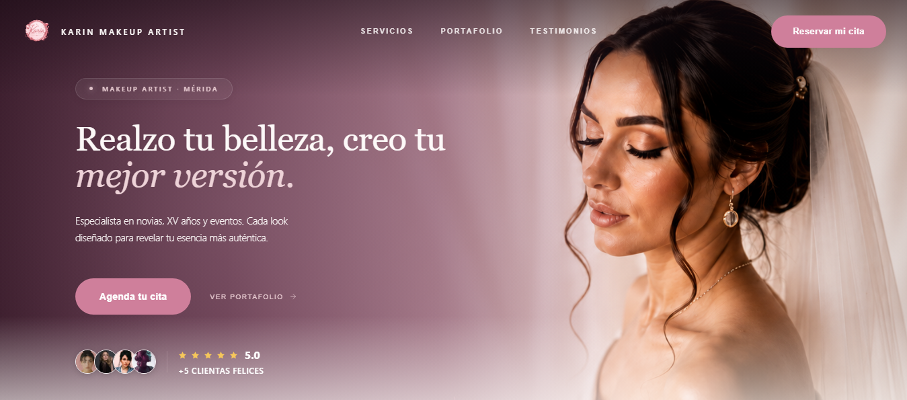

# KarinWeb

### Premium digital experience for Karin Makeup Artist

A full-stack web platform designed to transform a professional makeup artist's online presence into a complete digital experience for discovery, portfolio exploration, customer reviews and appointment booking.

**React · TypeScript · Vite · Supabase · Tailwind CSS · Motion**

---



---

## Overview

KarinWeb is a full-stack web platform built for a professional makeup artist based in Mérida, Yucatán.

The project combines a premium public-facing website with a private administrative workspace, allowing the business to manage its digital presence without depending on code changes for everyday operations.

The platform covers the complete customer journey:

**Discovery → Services → Portfolio → Reviews → Booking**

---

## Project

**Client:** Karin Makeup Artist  
**Type:** Full-stack business platform  
**Location:** Mérida, Yucatán  
**Status:** Production-ready

---

## The Challenge

The goal was not simply to create a visually appealing website.

Karin Makeup Artist needed a digital experience capable of presenting professional services, building trust through previous work and customer reviews, and turning visitors into appointment requests.

At the same time, the business needed to manage its digital presence without depending on code changes for everyday tasks.

The main challenges were:

- Presenting multiple makeup services with clear differentiation
- Showcasing previous work through a visual portfolio
- Building trust through customer reviews and featured experiences
- Creating a simple and intentional booking flow
- Giving the business control over services, gallery content and reviews
- Maintaining a consistent premium visual identity across devices
- Designing an administrative experience efficient enough for everyday content management

---

## The Solution

KarinWeb was designed as two connected experiences.

### Public Experience

The public website focuses on discovery, trust and conversion.

Visitors can:

- Explore professional makeup services
- Browse the portfolio and gallery
- Discover featured work
- Read customer reviews
- Learn about the brand and its services
- Start the appointment booking process

### Administrative Workspace

A private workspace gives the business direct control over its digital content.

Administrators can:

- Manage services
- Upload and organize portfolio projects
- Reorder gallery content
- Highlight featured projects
- Moderate customer reviews
- Respond to reviews
- Manage reservations
- Configure landing page content

---

## Key Features

### Public Experience

- Premium responsive landing page
- Dynamic service catalog
- Portfolio and gallery exploration
- Search and filtering for portfolio content
- Featured projects
- Customer testimonials
- Featured customer reviews
- Responsive navigation and mobile experience
- WhatsApp contact integration
- Motion-driven interactions and micro-interactions

### Appointment Booking

- Guided appointment booking flow
- Service selection
- Date and time selection
- Client information
- Optional home-service requests
- Address collection for home appointments
- Reference image upload
- Reservation validation
- Booking confirmation flow

### Review System

- Public review submission
- Review moderation workflow
- Pending, approved, rejected and spam states
- Administrative replies
- Featured reviews
- Optimistic UI updates for moderation actions
- Customer review media support

### Administrative Workspace

- Secure administrator authentication
- Dashboard overview
- Service management
- Gallery management
- Bulk gallery actions
- Featured project management
- Gallery reordering
- Reservation management
- Review moderation
- Landing page content management
- Workspace configuration

### Engineering

- Domain-oriented frontend architecture
- Type-safe React and TypeScript codebase
- Supabase PostgreSQL backend
- Supabase Authentication
- Supabase Storage
- Row Level Security
- Database RPC functions for controlled operations
- Route-level code splitting
- Responsive UI architecture
- Reusable UI components

---

## Tech Stack

| Layer           | Technology         |
| --------------- | ------------------ |
| Frontend        | React              |
| Language        | TypeScript         |
| Build Tool      | Vite               |
| Styling         | Tailwind CSS       |
| Animation       | Motion             |
| Data Fetching   | TanStack Query     |
| Backend         | Supabase           |
| Database        | PostgreSQL         |
| Authentication  | Supabase Auth      |
| File Storage    | Supabase Storage   |
| Security        | Row Level Security |
| Icons           | Lucide             |
| Version Control | Git / GitHub       |
| Deployment      | Vercel             |

---

## Architecture

KarinWeb follows a domain-oriented frontend architecture designed to keep business logic, data access and UI concerns organized around the capabilities of the product.

```text
src/
├── domains/
│   ├── admin/
│   ├── auth/
│   ├── booking/
│   ├── content/
│   ├── invitations/
│   ├── moderation/
│   ├── reviews/
│   └── workspace/
│
├── landing/
├── portfolio/
├── components/
└── lib/
```

### Domain-oriented structure

Instead of organizing the entire application around generic UI components, the project groups functionality by business domain.

For example:

- `booking/` handles appointment-related functionality
- `reviews/` manages the review system
- `moderation/` handles administrative review workflows
- `workspace/` contains the private management experience
- `content/` builds and manages public-facing content
- `portfolio/` manages the public portfolio experience

This structure makes it easier to extend individual areas of the product without coupling unrelated features together.

---

## Application Architecture

The platform is composed of two main experiences connected through Supabase.

```text
                    KARINWEB
                       │
          ┌────────────┴────────────┐
          │                         │
          ▼                         ▼
   Public Experience        Admin Workspace
          │                         │
          ├── Landing              ├── Dashboard
          ├── Services             ├── Services
          ├── Portfolio            ├── Gallery
          ├── Reviews              ├── Reviews
          └── Booking              └── Reservations
                    │
                    ▼
                 Supabase
                    │
        ┌───────────┼───────────┐
        ▼           ▼           ▼
    PostgreSQL     Auth       Storage
        │
        ▼
   Row Level Security
```

The public experience focuses on discovery, trust and conversion, while the administrative workspace provides the tools required to manage the business's digital presence.

---

## Backend & Data Layer

Supabase provides the core backend infrastructure for the application.

The platform uses:

- PostgreSQL for structured application data
- Supabase Auth for administrator authentication
- Supabase Storage for uploaded media
- Row Level Security for database access control
- Database RPC functions for controlled business operations

The frontend communicates with the backend through domain-specific repositories and services rather than coupling every feature directly to the database layer.

This separation helps keep data access logic independent from the UI.

---

## UX & Design

The interface was designed around a premium editorial aesthetic that reflects the positioning of a professional makeup artist while maintaining usability across desktop and mobile devices.

The design system combines refined typography, soft neutral tones, generous spacing, subtle borders and restrained motion to create a visual experience that feels elegant without sacrificing clarity.

### Design Principles

#### Visual hierarchy

Content is structured around clear typographic hierarchy, spacing and contrast so visitors can quickly understand:

- What the business offers
- Which services are available
- What the work looks like
- Why customers trust the artist
- How to start the booking process

#### Conversion-focused navigation

The public experience is structured around the customer's decision journey:

**Discover → Explore → Build Trust → Book**

Primary calls to action are intentionally placed throughout the experience without overwhelming the interface.

#### Responsive experience

The interface was designed to adapt across desktop, tablet and mobile layouts.

Particular attention was given to:

- Navigation behavior
- Touch-friendly interactions
- Portfolio browsing
- Service cards
- Booking forms
- Typography scaling
- Content spacing

#### Motion & interaction

Motion is used as a supporting layer rather than as decoration.

Animations are applied to:

- Page transitions
- Portfolio interactions
- Navigation states
- Cards
- Modals
- Gallery reordering
- Feedback states

The goal is to provide visual feedback and reinforce hierarchy while keeping interactions fast and unobtrusive.

---

## Administrative UX

The administrative workspace was designed with a different priority:

**Speed, clarity and control.**

Unlike the public website, the dashboard is optimized for repeated daily tasks.

Examples include:

- Bulk gallery actions
- Fast portfolio reordering
- Featured content controls
- Review moderation
- Reservation management
- Immediate feedback after mutations
- Clear empty and loading states

The gallery reordering experience was specifically designed to reduce the friction of manually organizing a growing portfolio.

Instead of requiring repeated individual movements, the workspace provides a dedicated ordering experience with direct drag interactions and batch operations.

---

## Design System

The interface maintains a consistent visual language across the public website and administrative workspace.

Key elements include:

- Consistent spacing scale
- Reusable UI components
- Responsive typography
- Shared interaction patterns
- Consistent border and surface treatments
- Accessible contrast considerations
- Reusable motion patterns

---

## Engineering Decisions

### Domain-oriented architecture

The application is organized around business capabilities rather than a flat collection of components.

This keeps related types, services, repositories, hooks and views close to the domain they serve.

The result is a codebase that can evolve feature-by-feature without turning the entire application into a tightly coupled component tree.

### Supabase as the backend platform

Supabase was selected to provide a unified backend layer for:

- PostgreSQL
- Authentication
- Storage
- Row Level Security
- RPC functions

This allowed the project to maintain a modern frontend architecture while keeping business data and access control centralized.

### Server-side business operations

Critical operations such as reservation submission are handled through controlled database operations rather than relying exclusively on client-side validation.

This reduces trust in client-provided state and allows business rules to be enforced closer to the data.

### Optimistic UI

Administrative interactions such as review moderation update the interface optimistically before the server round trip completes.

This makes frequent dashboard actions feel immediate while maintaining server persistence and query invalidation as the source of truth.

### Persistent gallery ordering

Portfolio projects use persistent ordering rather than relying solely on upload timestamps.

This allows administrators to intentionally curate the visual sequence of the portfolio without changing the underlying project records.

---

## Security

The application uses Supabase Row Level Security to separate public and administrative access.

Public users can access approved public content, while administrative operations require an authenticated workspace session.

The project also uses controlled database operations for business-critical workflows, reducing reliance on client-side assumptions.

Security policies and database permissions are treated as part of the application architecture rather than as an afterthought.

> Production credentials and environment secrets are intentionally excluded from version control.

---

## Performance

Performance was considered throughout the application architecture.

Current implementation includes:

- Route-level lazy loading
- Code splitting through Vite
- Lazy loading for non-critical views
- Reusable rendering patterns
- Optimized administrative data flows
- Efficient query caching through TanStack Query

Further performance work includes image optimization, responsive image delivery and continued bundle analysis.

Performance claims and Core Web Vitals should be measured against the deployed production build before publishing numerical results.

---

## Project Structure

```text
KarinWeb/
├── public/
│   └── images/
│
├── src/
│   ├── components/
│   ├── domains/
│   │   ├── admin/
│   │   ├── auth/
│   │   ├── booking/
│   │   ├── content/
│   │   ├── invitations/
│   │   ├── moderation/
│   │   ├── reviews/
│   │   └── workspace/
│   │
│   ├── landing/
│   ├── portfolio/
│   └── lib/
│
├── supabase/
│   ├── migrations/
│   └── seeds/
│
├── docs/
│   └── preview.png
│
├── package.json
├── vite.config.ts
├── tsconfig.json
└── README.md
```

---

## Development

### Requirements

- Node.js
- npm
- A Supabase project
- Environment variables configured locally

### Installation

```bash
npm install
```

### Environment

Create a local environment file based on the project's required Supabase configuration.

Do not commit real credentials or production secrets.

### Development server

```bash
npm run dev
```

### Production build

```bash
npm run build
```

The production build is validated through TypeScript compilation followed by the Vite production build.

---

## Deployment

The project is designed to be deployed through Vercel with the GitHub repository connected to the production deployment.

```text
GitHub
   │
   ▼
Vercel
   │
   ▼
Production
   │
   └── Supabase
```

Environment variables should be configured through the deployment platform rather than committed to the repository.

---

## Engineering Challenges

### Gallery ordering

The initial gallery experience displayed projects according to their stored ordering.

As the number of projects increased, manually moving items became slow and frustrating.

The solution was to introduce persistent `display_order` values and a dedicated reordering experience with direct drag interactions and batch operations.

This allows the content manager to visually reorganize the portfolio without modifying the underlying project data.

### Review moderation

Reviews require multiple states and administrative actions.

The moderation system supports:

- Pending reviews
- Approved reviews
- Rejected reviews
- Spam handling
- Featured reviews
- Administrative replies

Optimistic UI updates make moderation actions feel immediate while server-side persistence remains the source of truth.

### Content management

A core requirement was allowing the business owner to manage frequently changing content without requiring code changes.

The workspace therefore acts as a lightweight content management system for services, gallery projects, reviews, reservations and landing page configuration.

---

## Lessons Learned

Building KarinWeb reinforced several important engineering principles:

- Visual polish is only valuable when it supports usability.
- Content-heavy applications require careful image and data loading strategies.
- Administrative UX deserves the same attention as the public website.
- Server-side validation should not depend on client-side assumptions.
- A domain-oriented architecture makes feature growth easier to manage.
- Small interaction improvements can have a significant impact on perceived product quality.
- Business software benefits from treating internal tools as real products rather than secondary interfaces.

---

## Future Improvements

- Responsive image optimization with WebP/AVIF
- Advanced portfolio pagination
- Further SEO metadata and structured data improvements
- Analytics-driven booking optimization
- Automated reservation notifications
- Expanded accessibility audit
- Performance monitoring
- More granular content-management controls
- Additional dashboard productivity improvements

---

## Portfolio

KarinWeb was developed as a real-world business platform with the goal of combining premium visual design, practical business workflows and maintainable frontend architecture.

The project demonstrates the ability to move from a business requirement to a complete digital product — from customer-facing UX to backend data, authentication, administration and deployment.

---

## License

This repository is intended primarily as a portfolio and demonstration project.

Business-specific assets, branding, images and content belong to their respective owners and should not be reused without permission.
